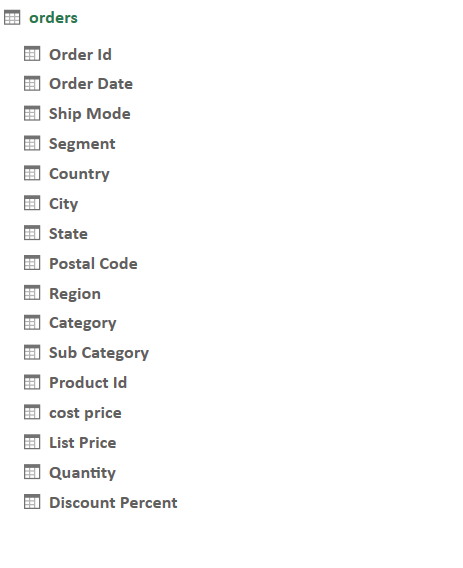
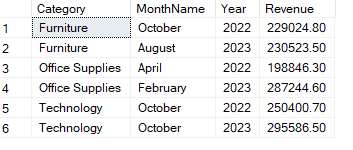
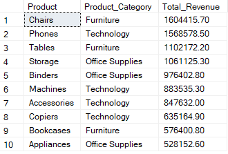
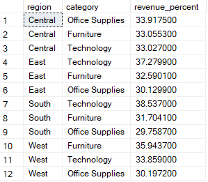

# Brothers Retail Sales Analysis

Brothers Retail is an US based e-commerce company specializing in Furniture, Office Supplies, and Technology products. The company serves a diverse customer base, including individual consumers, corporate buyers, and home offices. Brothers Retail operates across various regions in the United States, with a strong presence in multiple cities and states.
This report highlights the sales trends, profit margins, and the impact of discounts on revenue, providing a strong foundation for further analysis into underperforming products, regional sales performance, and customer segmentation.

## Table of Contents
1. [Overview](#overview)
2. [Data Model](#data-model)
3. [In-Depth Insights Review](#in-depth-insights-review)
    - [Sales Trends and Growth Rates](#sales-trends-and-growth-rates)
    - [Key Product Performance](#key-product-performance)
    - [Regional Sales](#regional-sales)
4. [Recommendations](#recommendations)

## Overview
The analysis of 9,994 orders over the span of two years provides insights into sales, pricing, discounts, and profitability. The average total sales per order is $1,108.60, with a maximum of $130,406.40, while the average sales price per unit is $221.72, reaching a peak of $21,734.40. The cost price averages $201.19, and products are listed at an average price of $229.76, with discounts ranging from 2% to 5% and an average discount of $8.04 per unit. The maximum discount applied to a single order was $905.60, contributing to a total discount of $6,428.50 across all orders. In terms of profitability, the average profit per order is $20.53, with the highest at $3,624.40, but some orders resulted in losses as low as -$5.00. Overall, the dataset reflects a total profit of $21,746.40. Order sizes vary, with an average of 3.79 units per order, ranging from 1 to 14 units.

## Data Model

- **Order Id** – Unique identifier for each order.  
- **Order Date** – The date when the order was placed.  
- **Ship Mode** – The shipping method selected for the order (e.g., Standard, Express).  
- **Segment** – The customer segment (e.g., Consumer, Corporate, Home Office).  
- **Country** – The country where the order was placed.  
- **City** – The city where the order was delivered.  
- **State** – The state where the order was delivered.  
- **Postal Code** – The postal code for the delivery location.  
- **Region** – The geographical region of the order (e.g., West, East, South, Central).  
- **Category** – The broad product category (e.g., Furniture, Office Supplies, Technology).  
- **Sub Category** – The specific sub-category within the main category (e.g., Chairs, Phones).  
- **Product Id** – Unique identifier for each product.  
- **Cost Price** – The original cost of the product before markup.  
- **List Price** – The selling price of the product before discounts.  
- **Quantity** – The number of units purchased in the order.  
- **Discount Percent** – The percentage discount applied to the order.  

## In-Depth Insights Review
### Sales Trends and Growth Rates

- Brothers Retail averages $5 million in annual sales with 5,000 orders per year.
- The data indicates strong seasonal fluctuations, where sales see drastic ups and downs. Months such as August 2022 and November 2023 stand out for high growth, while March 2022 and July 2023 stand out for steep declines.
- Technology claims the highest absolute revenue figure ($295,586.50) among the three categories for its top month in 2023.
- The West region made a total sales of $3.4 million across the span of two years, contributing to 31.29% of the overall revenue
- Office Supplies experienced a big jump in revenue from $198,846.30 in April 2022 to $287,244.60 February 2023, indicating an astounding growth of 44.5% in a single year.

### Key Product Performance

- Chairs generate a total of $1.6 million in revenue making it the highest revenue generating product.
- The top 3 products (Chairs, Phones, Tables) each generate over $1M in revenue, making them the biggest contributors.
- Phones are the top-performing product in Technology and the 2nd highest overall. Technology products hold 4 out of the top 10 spots, indicating a strong revenue contribution.
- Binders dominate all regions as the most-selling product, with the highest sales in the West region (471 units).
- Phones and Furnishings are strong performers in the East and West but have lower sales in the South and Central regions.
- With a YoY growth of 79.06%, Supplies shows the strongest increase in profit, outpacing all other product categories by a significant margin.

### Regional Sales 

- Machines dominate every region and segment in terms of order value. The Corporate segment in the South region shows an exceptionally high AOV for Machines ($14,135.58), the largest value across the four regions. The Corporate segment generally exhibits higher AOVs than Consumer or Home Office across all categories and regions, suggesting a strong purchasing power or more substantial orders from Corporate buyers.
- East Region shows a surprising spike in Copiers at $23,608, the highest for any category in the Home Office segment.
- The Central region displays a clear differentiation between segments, where Corporate orders (e.g., Copiers at $18,344.90) far exceed those in the Consumer and Home Office segments.
- East sees the strongest share for Technology (37.28%). South and West both show a preference for Furniture, at 38.54% and 35.94% respectively.
- Fasteners have the lowest performance across all regions, with an average sale value of just $63.05 in the West, confirming their weak demand.
- Envelopes underperform in both the East and West regions, indicating a weaker demand for mailing-related products. Promotional efforts or inventory reductions should be considered for these categories to optimize stock and improve sales performance.
- West Leads in Total Annual Sales generating $3.47M revenue in total, outpacing East ($3.26M), Central ($2.08M), and South ($1.98M).

## Recommendations
- Chairs, Phones, and Tables generate the highest revenue ($1.6M+). Consider bulk discounts, targeted marketing, and bundling offers to push these even further. Phones, a top product in Technology, should receive enhanced digital marketing efforts and loyalty-based promotions to drive repeat purchases.
- Fasteners, Envelopes, and Storage underperform across regions. Introduce:
  - Bundled offers (e.g., Envelopes with Office Supplies).
  - Flash sales & clearance discounts for slow-moving inventory.
  - Alternative suppliers to cut costs if margins are low.
- The West leads in total revenue ($3.47M), surpassing all other regions. Increase ad spend and regional partnerships to maintain dominance. Expand local fulfillment centers to improve shipping times and reduce logistics costs.
- The South & Central regions lag behind in revenue. Introduce exclusive discounts & region-specific promotions to increase engagement. Leverage local influencers & community-based marketing to target corporate and home office buyers.
- Reduce discounts on top-performing items like Chairs and Phones. Introduce tiered pricing models where bulk buyers pay less per unit.

 

See the raw data and my cleaning in the [Jupyter Notebook](retail_orders.ipynb). 
See the queries I used to analyse the data in [Queries](Analysis.sql).

